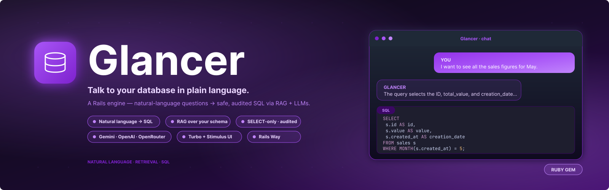
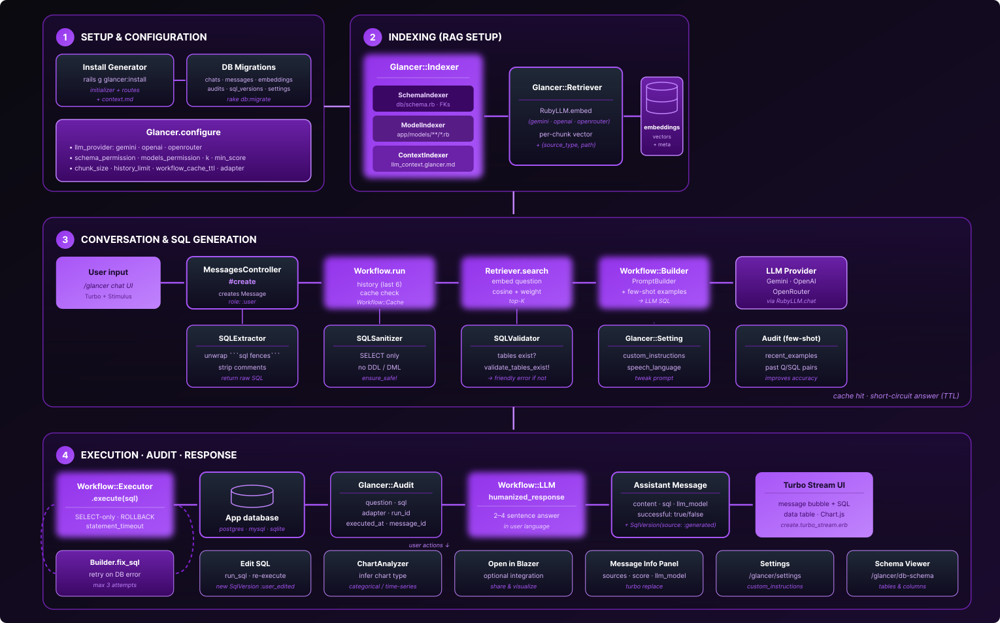

A Ruby on Rails engine that adds a **natural language database query interface** to Rails app. Ask questions in plain English (or any language), get back valid SQL, executed results, and a humanized explanation — all powered by your chosen LLM.

```m
"How many orders were placed in the last 30 days, grouped by status?"
→ SQL generated and explained automatically.
```

## How it works

Glancer implements a RAG (Retrieval-Augmented Generation) pipeline:



1. **Index** — your schema, models, and custom context are chunked and embedded into a local vector store.
2. **Retrieve** — when a question is asked, the most relevant chunks are retrieved via cosine similarity.
3. **Generate** — a prompt containing the schema context and conversation history is sent to your LLM, which returns a `SELECT` statement.
4. **Validate** — the SQL is sanitized (no destructive statements) and validated against indexed table names.
5. **Execute** — the query runs inside a transaction that always rolls back (safe read-only execution).
6. **Humanize** — a second LLM call explains the query logic in natural language.

## Requirements

- Ruby >= 3.1
- Rails >= 7.0
- An API key for Gemini, OpenAI, or OpenRouter


## Installation

Add to your `Gemfile`:

```ruby
gem "glancer"
```

Run the install generator:

```bash
bundle install
rails generate glancer:install
rails db:migrate
```

The generator:
- Creates `config/initializers/glancer.rb` (your configuration file)
- Creates `config/glancer/llm_context.glancer.md` (optional domain context)
- Mounts the engine at `/glancer` in `config/routes.rb`


## Configuration

Edit `config/initializers/glancer.rb`. The most important options:

```ruby
Glancer.configure do |config|
  # LLM provider: :gemini | :openai | :openrouter
  config.llm_provider = :gemini
  config.llm_model    = "gemini-2.0-flash"

  # API key for the chosen provider
  config.gemini_api_key = ENV["GEMINI_API_KEY"]
  # config.openai_api_key     = ENV["OPENAI_API_KEY"]
  # config.openrouter_api_key = ENV["OPENROUTER_API_KEY"]

  # Allow indexing db/schema.rb (required for SQL generation)
  config.schema_permission = true
end
```

### Split providers per role

You can use different models for SQL generation, chat responses, and embeddings:

```ruby
config.llm_provider       = :gemini          # default fallback
config.llm_model          = "gemini-2.0-flash"
config.sql_provider       = :openai          # code-focused model for SQL
config.sql_model          = "gpt-4o"
config.chat_provider      = :gemini          # cheaper for humanized responses
config.chat_model         = "gemini-2.0-flash"
config.embedding_provider = :gemini          # dedicated embeddings
config.embedding_model    = "text-embedding-004"
```

### All configuration options

| Option | Default | Description |
|---|---|---|
| `adapter` | auto-detected | `:postgres`, `:mysql`, `:mysql2`, or `:sqlite` |
| `read_only_db` | `nil` | Replica connection URL; queries run against it when set |
| `statement_timeout` | `30.seconds` | Max query execution time (PostgreSQL/MySQL enforced server-side) |
| `llm_provider` | `:gemini` | Default LLM provider for all roles |
| `llm_model` | `"gemini-2.0-flash"` | Default model |
| `sql_provider` / `sql_model` | `nil` (inherits default) | Provider/model for SQL generation |
| `chat_provider` / `chat_model` | `nil` (inherits default) | Provider/model for humanized responses |
| `embedding_provider` / `embedding_model` | `nil` (inherits default) | Provider/model for embeddings |
| `schema_permission` | `false` | Index `db/schema.rb` |
| `models_permission` | `false` | Index `app/models/**/*.rb` |
| `context_file_path` | `"config/glancer/llm_context.glancer.md"` | Custom domain context file |
| `chunk_size` | `1000` | Max characters per embedding chunk |
| `chunk_overlap` | `150` | Overlap between chunks to prevent context loss |
| `k` | `5` | Number of top chunks retrieved per query |
| `min_score` | `0.6` | Minimum cosine similarity for a chunk to be included |
| `schema_documents_weight` | `1.3` | Retrieval boost for schema chunks |
| `context_documents_weight` | `1.2` | Retrieval boost for context chunks |
| `models_documents_weight` | `1.1` | Retrieval boost for model chunks |
| `history_limit` | `6` | Past messages included in the prompt |
| `workflow_cache_ttl` | `1.minute` | In-memory cache TTL; `0` to disable |
| `log_verbosity` | `:info` | `:none`, `:info`, or `:debug` |
| `log_output_path` | `nil` | Log file path; `nil` → Rails logger |
| `blazer_path` | `nil` (auto) | Base path for Blazer integration; auto-detected if `blazer` gem is present |

## Indexing

Glancer stores embeddings in the `glancer_embeddings` table. Run indexing after setup and whenever the schema changes significantly:

```bash
rails glancer:index:all       # Index schema + models + context
rails glancer:index:schema    # Index db/schema.rb only
rails glancer:index:models    # Index app/models/**/*.rb
rails glancer:index:context   # Index the custom context Markdown file
```

### Custom context

`config/glancer/llm_context.glancer.md` is a Markdown file where you describe domain knowledge: table aliases, business rules, common query patterns, relationships the schema doesn't make obvious. The more context you provide, the better the SQL generation.

Add `--glancer-ignore` as the first line of the file to skip it during indexing.


## Usage

Visit `/glancer` in your browser. The chat interface lets you:

- Ask questions in any language — the LLM responds in the same language.
- View the generated SQL, edit it, and re-run it.
- Export results as CSV (client-side, no backend endpoint).
- Browse the indexed schema at `/glancer/db-schema`.
- Set custom instructions at `/glancer/settings`.

If the **Blazer** gem is in your app, an "Open in Blazer" button appears on each generated query.

## Safety

- **Read-only by default** — all queries execute inside a transaction that always rolls back.
- **No destructive SQL** — `DELETE`, `UPDATE`, `INSERT`, `DROP`, `TRUNCATE`, `ALTER`, `CREATE`, and `REPLACE` statements are blocked before execution.
- **Table validation** — the LLM's referenced tables are validated against indexed table names before execution.
- **Audit log** — every query attempt is recorded in `glancer_audits` with a unique `run_id` UUID injected as an SQL comment.
- **Replica support** — route queries to a read-only replica via `config.read_only_db`.

## Development

```bash
bundle install
bundle exec rake spec        # Run tests
bundle exec rake rubocop     # Lint
bundle exec rake             # Tests + lint (default, matches CI)
```

To run a single spec:

```bash
bundle exec rspec spec/path/to/file_spec.rb
```

To test against a host Rails app, reference the gem by path:

```ruby
# In the host app's Gemfile:
gem "glancer", path: "../glancer"
```

## Contributing

Bug reports and pull requests are welcome on [GitHub](https://github.com/ernanej/glancer).
Please read the [Code of Conduct](CODE_OF_CONDUCT.md) before contributing.

## License

[MIT License](LICENSE.txt).