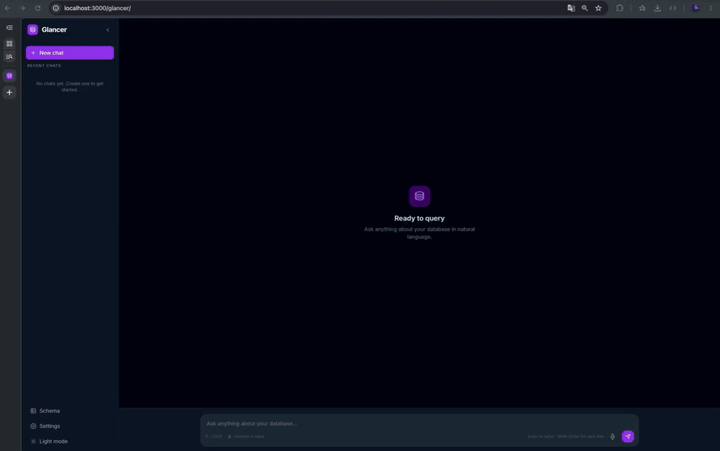

<p align="center">
  
</p>

<p align="center">
  <strong>Natural language database queries for your Rails app — powered by RAG and LLMs.</strong>
</p>

<p align="center">
  <!-- CI -->
  <a href="https://github.com/ErnaneJ/glancer/actions/workflows/ci.yml">
    
  </a>
  <!-- Coverage -->
  <a href="https://github.com/ErnaneJ/glancer">
    
  </a>
  <!-- Gem version — add once published to RubyGems -->
  <!-- <a href="https://rubygems.org/gems/glancer">
    
  </a> -->
  <!-- License -->
  <a href="LICENSE.txt">
    
  </a>
  <!-- Ruby -->
  <a href="https://www.ruby-lang.org/en/">
    = 3.1">
  </a>
  <!-- Rails -->
  <a href="https://rubyonrails.org/">
    = 7.0">
  </a>
</p>

---

> **Note:** The RubyGems version badge will be activated once the gem is published. Add `[](https://rubygems.org/gems/glancer)` to the badge row above.

---

## What is Glancer?

Glancer is a **Ruby on Rails engine** that mounts a full-featured chat interface inside your app and lets anyone on your team query the database in plain language — no SQL knowledge required.

You ask a question. Glancer retrieves the relevant schema context, asks the LLM to write a `SELECT` statement, validates and executes it safely, then returns the results alongside a human-readable explanation.

```
"How many orders were placed in the last 30 days, grouped by status?"
→ SQL generated, executed, and explained automatically.
```

<!-- Screenshot / demo GIF placeholder -->
<!-- Add a screenshot of the chat UI here -->
<!-- <p align="center">
  
</p> -->

---

## Why Glancer?

Every Rails app accumulates tables and columns whose meaning lives in the heads of a few engineers. Product managers open tickets to ask simple questions. Data analysts copy-paste schemas into ChatGPT. Engineers spend time writing one-off queries for stakeholders.

Glancer removes that friction. It gives your app a persistent, context-aware SQL assistant that understands your domain — not just generic SQL — because you teach it your schema, your models, and your business rules through a plain Markdown file.

Key design decisions:

- **Safety first** — queries execute inside a transaction that always rolls back. No write statements can ever reach the database.
- **Your LLM, your cost** — bring your own Gemini, OpenAI, or OpenRouter API key. Mix providers per role to optimise cost vs. quality.
- **No external vector store** — embeddings live in your existing database. No extra infrastructure.
- **Rails-native** — mounted as an engine, uses Turbo and Stimulus, installs with one generator.

---

## Architecture

Glancer implements a **RAG (Retrieval-Augmented Generation)** pipeline. Each question goes through six stages:

```
Question
   │
   ▼
1. Embed ──────────── Converts the question to a vector embedding
   │
   ▼
2. Retrieve ────────── Cosine similarity search over glancer_embeddings
   │                   Weights: schema 1.3×, context 1.2×, models 1.1×
   ▼
3. Generate SQL ─────── LLM receives schema chunks + history → returns SELECT
   │
   ▼
4. Validate ────────── SQLSanitizer (blocks destructive keywords)
   │                   SQLValidator (checks table names against index)
   ▼
5. Execute ─────────── Read-only transaction (always rolls back)
   │                   Audit record written with run_id UUID
   ▼
6. Humanize ────────── Second LLM call explains the query in plain language
                        Response cached in memory (configurable TTL)
```

### Auto-retry

If execution fails (e.g. a column name hallucination), the error is fed back to the LLM and a corrected query is attempted — up to **3 times** — before returning a friendly failure message.

### Database tables

| Table | Purpose |
|---|---|
| `glancer_chats` | Conversation containers |
| `glancer_messages` | User / assistant turns; stores generated SQL and execution state |
| `glancer_embeddings` | Vector store: content, embedding (JSONB on PG / JSON elsewhere), source type and path |
| `glancer_audits` | Immutable query log with unique `run_id` per execution |
| `glancer_settings` | Runtime configuration (e.g. custom instructions) |
| `glancer_sql_versions` | SQL edit history per message |

---

## Requirements

- Ruby ≥ 3.1
- Rails ≥ 7.0
- An API key for **Gemini**, **OpenAI**, or **OpenRouter**
- SQLite, PostgreSQL, or MySQL/MariaDB

---

## Installation

### 1. Add to your Gemfile

```ruby
gem "glancer"
```

```bash
bundle install
```

### 2. Run the install generator

```bash
rails generate glancer:install
```

This creates:

- `config/initializers/glancer.rb` — your configuration file
- `config/glancer/llm_context.glancer.md` — optional domain context (Markdown)
- Mounts the engine at `/glancer` in `config/routes.rb`

### 3. Migrate the database

```bash
rails db:migrate
```

### 4. Index your schema

```bash
rails glancer:index:all
```

### 5. Visit the interface

```
http://localhost:3000/glancer
```

---

## Configuration

Edit `config/initializers/glancer.rb`. Minimal setup:

```ruby
Glancer.configure do |config|
  config.llm_provider   = :gemini
  config.llm_model      = "gemini-2.0-flash"
  config.gemini_api_key = ENV["GEMINI_API_KEY"]

  config.schema_permission = true   # required — indexes db/schema.rb
end
```

### Split providers per role

You can use different models for SQL generation, chat responses, and embeddings:

```ruby
Glancer.configure do |config|
  config.llm_provider = :gemini               # fallback for any unspecified role

  config.sql_provider = :openai               # code-focused model for SQL generation
  config.sql_model    = "gpt-4o"

  config.chat_provider = :gemini              # cheaper model for humanized responses
  config.chat_model    = "gemini-2.0-flash"

  config.embedding_provider = :gemini
  config.embedding_model    = "text-embedding-004"
end
```

### Full configuration reference

| Option | Default | Description |
|---|---|---|
| `adapter` | auto-detected | `:postgres`, `:mysql`, `:mysql2`, or `:sqlite` |
| `read_only_db` | `nil` | Replica connection URL; queries run against it when set |
| `statement_timeout` | `30.seconds` | Max query execution time (enforced server-side on PG/MySQL) |
| `llm_provider` | `:gemini` | Default LLM provider for all roles |
| `llm_model` | `"gemini-2.0-flash"` | Default model |
| `sql_provider` / `sql_model` | `nil` (inherits default) | Provider/model used for SQL generation |
| `chat_provider` / `chat_model` | `nil` (inherits default) | Provider/model used for humanized responses |
| `embedding_provider` / `embedding_model` | `nil` (inherits default) | Provider/model used for embeddings |
| `gemini_api_key` | `nil` | Gemini API key |
| `openai_api_key` | `nil` | OpenAI API key |
| `openrouter_api_key` | `nil` | OpenRouter API key |
| `schema_permission` | `false` | Index `db/schema.rb` |
| `models_permission` | `false` | Index `app/models/**/*.rb` |
| `context_file_path` | `"config/glancer/llm_context.glancer.md"` | Custom domain context file |
| `chunk_size` | `1000` | Max characters per embedding chunk |
| `chunk_overlap` | `150` | Overlap between consecutive chunks |
| `k` | `5` | Top-k chunks retrieved per question |
| `min_score` | `0.6` | Minimum cosine similarity threshold (0.0–1.0) |
| `schema_documents_weight` | `1.3` | Retrieval score boost for schema chunks |
| `context_documents_weight` | `1.2` | Retrieval score boost for context chunks |
| `models_documents_weight` | `1.1` | Retrieval score boost for model chunks |
| `history_limit` | `6` | Prior turns included in the LLM prompt |
| `workflow_cache_ttl` | `1.minute` | In-memory result cache TTL; `0` to disable |
| `log_verbosity` | `:info` | `:silent`, `:none`, `:info`, or `:debug` |
| `log_output_path` | `nil` | Log file path; `nil` writes to stdout |
| `blazer_path` | `nil` (auto) | Blazer base path; auto-detected when `blazer` gem is present |

---

## Indexing

Glancer embeds your schema, models, and custom context into the `glancer_embeddings` table. Run indexing after installation and whenever the schema changes significantly.

```bash
rails glancer:index:all       # Schema + models + context (prompts confirmation)
rails glancer:index:schema    # db/schema.rb only
rails glancer:index:models    # app/models/**/*.rb
rails glancer:index:context   # Custom context Markdown file
rails glancer:version         # Print gem version
```

### Custom context file

`config/glancer/llm_context.glancer.md` is the place to describe domain knowledge that lives outside the schema:

```markdown
# Domain context

- The `orders` table uses `status` = "pending" | "paid" | "shipped" | "refunded".
- `users.role` can be "admin", "agent", or "customer". Admins are never counted in retention metrics.
- Monthly revenue = SUM(orders.total) WHERE status = "paid".
- When asked about "churn", use the `churned_at` column on the `subscriptions` table.
```

Add `--glancer-ignore` as the **first line** of the file to skip it during indexing.

---

## Chat Interface

<!-- Screenshot placeholder -->
<!-- <p align="center">
  
</p> -->

Visit `/glancer` in your browser. The interface provides:

- **Multi-language support** — ask in any language; the LLM responds in the same language.
- **Pipeline status** — animated step labels show what the engine is doing while it works.
- **Generated SQL** — syntax-highlighted, copyable, and editable before execution.
- **SQL editing** — click Edit to modify the generated query and re-run it. Edited queries show a badge.
- **Results table** — sortable, with a one-click CSV export (client-side, no backend).
- **Accordion panels** — results collapse when a new query runs; panels can be toggled.
- **Blazer button** — opens the query in Blazer pre-filled, if the gem is installed.
- **Audio input** — click the microphone button to dictate your question.
- **Copy buttons** — copy the SQL or the full assistant response with one click.
- **Custom instructions** — set persistent system-level instructions at `/glancer/settings`.
- **Schema viewer** — browse indexed tables and columns at `/glancer/db-schema`.

---

## Safety

Glancer is designed to be safe to deploy on production databases.

| Layer | Mechanism |
|---|---|
| **No writes** | All queries run inside a transaction that unconditionally rolls back |
| **Keyword blocklist** | `DELETE`, `UPDATE`, `INSERT`, `DROP`, `TRUNCATE`, `ALTER`, `CREATE`, `REPLACE` are rejected before execution |
| **Table validation** | Referenced tables are checked against the indexed schema; unknown tables return a friendly error |
| **Statement timeout** | `statement_timeout` (PG) / `max_execution_time` (MySQL) kills runaway queries server-side |
| **Audit trail** | Every attempt is recorded in `glancer_audits` with a `run_id` UUID injected as a SQL comment |
| **Replica support** | Route queries to a read-only replica via `config.read_only_db` |

---

## Usage via Ruby classes

You can use Glancer's internals directly from the Rails console or your own code.

```ruby
# Re-index everything
Glancer::Indexer.rebuild_all!

# Run the full pipeline for a question
result = Glancer::Workflow.run(
  chat_id:  chat.id,
  question: "Which products have never been ordered?",
)
# => { content: "...", sql: "SELECT ...", successful: true }

# Retrieve relevant chunks for a question (without generating SQL)
chunks = Glancer::Retriever.retrieve("monthly revenue by region")

# Check a specific SQL against the safety layer
Glancer::Workflow::SQLSanitizer.ensure_safe!("SELECT * FROM users")

# Validate table references against the indexed schema
Glancer::Workflow::SQLValidator.validate_tables_exist!("SELECT * FROM orders")
```

---

## Routes

The engine mounts the following routes under the prefix configured in your `routes.rb` (default `/glancer`):

```
GET  /glancer                      → chats#index
GET  /glancer/chats/:id            → chats#show
POST /glancer/chats                → chats#create
DEL  /glancer/chats/:id            → chats#destroy
POST /glancer/chats/:id/messages   → messages#create
GET  /glancer/messages/:id/info    → messages#info (SQL + sources panel)
POST /glancer/messages/:id/run_sql → messages#run_sql (re-execute saved SQL)
GET  /glancer/db-schema            → db_schema#show
GET  /glancer/settings             → settings#show
```

---

## Development

```bash
git clone https://github.com/ErnaneJ/glancer
cd glancer
bundle install
```

```bash
bundle exec rake          # Tests + RuboCop (mirrors CI)
bundle exec rake spec     # RSpec only
bundle exec rake rubocop  # RuboCop only

# Run a single spec file
bundle exec rspec spec/lib/glancer/workflow/executor_spec.rb

# Run tests with coverage report
COVERAGE=1 bundle exec rspec
```

To develop against a host Rails application, use a path reference in its `Gemfile`:

```ruby
gem "glancer", path: "../glancer"
```

---

## Contributing

Bug reports, feature requests, and pull requests are welcome on [GitHub](https://github.com/ErnaneJ/glancer).

Before opening a pull request:

1. Fork the repository and create a feature branch.
2. Write tests for your changes (`bundle exec rake spec` must stay green).
3. Ensure RuboCop is clean (`bundle exec rake rubocop`).
4. Update `CHANGELOG.md` under `[Unreleased]`.
5. Open a pull request with a clear description of what changed and why.

Please read the [Code of Conduct](CODE_OF_CONDUCT.md) before contributing.

---

## License

Glancer is available as open source under the [MIT License](LICENSE.txt).
